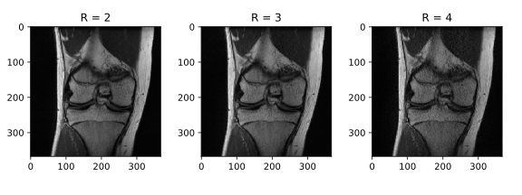
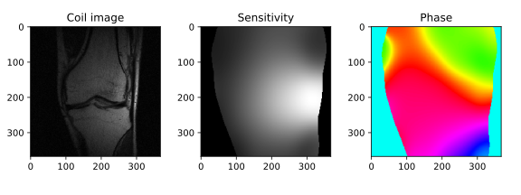

## Some MRI algorithms

Maybe this code can be helpful in your MRI research.

This small module implements the following algorithms:
* GRAPPA [1]
* SPIRiT [2] (kernel only)
* PRUNO [3] (only null space matrix)
* ESPIRiT [4]

#### Examples
GRAPPA reconstruction [1]:
<pre>
>>> from kspace import grappa_kernel, conv
>>> # matrix size = 640 x 368
>>> asc_rect = (306, 334), (170, 198)
>>> # defining kernel pattern for regular sampling
>>> kernel = np.array([
>>>     [1, 0, 1, 0, 1, 0, 1],
>>>     [1, 0, 1, 0, 1, 0, 1],
>>>     [1, 0, 1, 0, 1, 0, 1],
>>>     [1, 0, 1, 0, 1, 0, 1],
>>>     [1, 0, 1, 0, 1, 0, 1],
>>> ])
>>> # calculation of the convolutional kernel
>>> G = grappa_kernel(data, kernel, asc_rect)
>>> # reconstruction
>>> data = conv(data, G) * mask_R2_c
</pre>
Alternatively, for an acceleration factor R = 4:
<pre>
>>> from kspace import grappa_kernel_1d
>>> G1 = grappa_kernel_1d(f, R=4, r=1, v_size=5, num_nodes=2, acs_start=170, acs_stop=198, lamda=0)
>>> G2 = grappa_kernel_1d(f, R=4, r=2, v_size=5, num_nodes=2, acs_start=170, acs_stop=198, lamda=0)
>>> G3 = grappa_kernel_1d(f, R=4, r=3, v_size=5, num_nodes=2, acs_start=170, acs_stop=198, lamda=0)
>>> # reconstruction
>>> data = (
>>>     conv(data, G1) * mask_R4_c1 +
>>>     conv(data, G2) * mask_R4_c2 +
>>>     conv(data, G3) * mask_R4_c3
>>> )
</pre>

Examples of results are shown in the figure below.

Calculation of coil sensitivity using ESPIRiT [4]:
<pre>
>>> from kspace import espirit
>>> s = espirit(data, 3, 3, acs_rect, num_basis=25, threshold=0.05)
</pre>

The following plot depicts the image from one channel (coil) and the corresponding
approximation of coil sensitivity (magnitude and phase).

#### References
1. M. A. Griswold, P. M. Jakob, R. M. Heidemann, M. Nittka, V. Jellus, J. Wang, B. Kiefer, and A. Haase, "Generalized autocalibrating partially parallel acquisitions (GRAPPA)," Magnetic Resonance in Medicine, vol. 47, no. 6, pp. 1202–1210, 2002.
2. M. Lustig and J. M. Pauly, "SPIRiT: Iterative self-consistent parallel imaging reconstruction from arbitrary k-space," Magnetic Resonance in Medicine, vol. 64, no. 2, pp. 457–471, 2010.
3. J. Zhang, C. Liu, and M. E. Moseley, "Parallel reconstruction using null operations," Magnetic Resonance in Medicine, vol. 66, no. 5, pp. 1241–1253, 2011.
4. M. Uecker, P. Lai, M. J. Murphy, P. Virtue, M. Elad, J. M. Pauly, S. S. Vasanawala, and M. Lustig, "ESPIRiT – an eigenvalue approach to autocalibrating parallel MRI: Where SENSE meets GRAPPA," Magnetic Resonance in Medicine, vol. 71, no. 3, pp. 990–1001, 2014.

